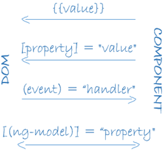
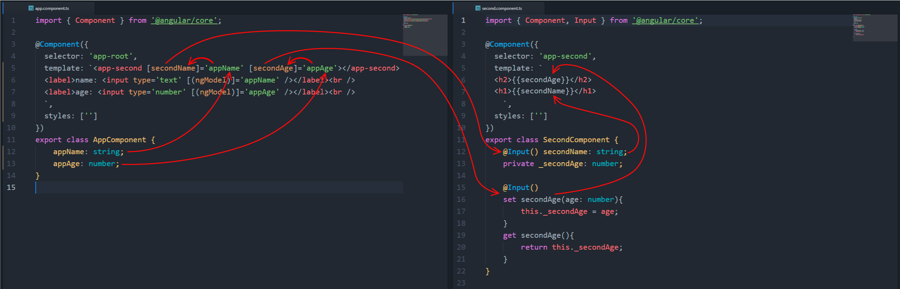
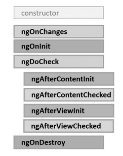

# Angular

## Компонент

**Компонент**(**Component**) -- это наиболее фундаментальная концепция Angular. Компонент настраивает **отображение**(**view**) -- часть веб-страницы, где мы показываем информацию пользователю и реагируем на его действия.

Технически, **компонент -- это класс**, который контролирует шаблон отображения.

Чтобы класс мог использоваться в других модулях, он определяется с ключевым словом **export**

Для создания компонента необходимо импортировать функцию декоратора **@Component** из библиотеки **'@angular/core'**. Декоратор **@Component** позволяет **идентифицировать класс как компонент**.

Файл компонента:

```typescript
import { Component } from '@angular/core';

@Component({
    selector: 'my-app',
    template: ``
})
export class AppComponent {
}
```

--------------------------------------------------------------------------------

## Модуль

Каждое приложение Angular как минимум имеет один **корневой модуль** (**root module**), который, согласно условностям, называется AppModule

Для работы модуля ему необходимы **ряд библиотек**, поэтому в начале файла идет **их подключение**. Имя каждой библиотеки Angular начинается с префикса **@angular**.

Файл модуля:

```typescript
import { NgModule }      from '@angular/core';
import { BrowserModule } from '@angular/platform-browser';
import { FormsModule }   from '@angular/forms';
import { AppComponent }   from './app.component';
```

- **NgModule**: функциональность декоратора NgModule, без которой мы не сможем создать модуль
- **BrowserModule**: модуль, необходимый для работы с браузером
- **FormsModule**: модуль, необходимый для работы с формами html и, в частности, с элементами input. (Так как класс компонента работает с подобными элементами, то мы обязаны также импортировать этот модуль)
- **AppComponent**: функциональность корневого компонента приложения

<br>

**NgModule** представляет функцию-декоратора, которая **принимает объект**, свойства которого описывают метаданные модуля.

Каждый модуль должен определяться с декоратором **@NgModule**.

```typescript
@NgModule({
    imports: [ BrowserModule, FormsModule ],
    declarations: [ AppComponent ],
    bootstrap: [ AppComponent ],
    exports: [ ],
    providers: [ ]
})
```

Наиболее важные свойства:

- **declarations**: классы представлений (view classes), которые принадлежат модулю. Angular имеет **три типа классов представлений**:

  - **компоненты** (**components**)
  - **директивы** (**directives**)
  - **каналы** (**pipes**)

- **exports**: набор классов представлений, которые должны использоваться в шаблонах компонентов из других модулей
- **imports**: другие модули, классы которых необходимы для шаблонов компонентов из текущего модуля
- **providers**: классы, создающие сервисы, используемые модулем
- **bootstrap**: корневой компонент, который вызывается по умолчанию при загрузке приложения ( какой именно компонент будет использоваться в качестве основного при загрузке )

<br><br>

```typescript
import { NgModule }      from '@angular/core';
import { BrowserModule } from '@angular/platform-browser';
import { FormsModule }   from '@angular/forms';
import { AppComponent }   from './app.component';

@NgModule({
    imports:      [ BrowserModule, FormsModule ],
    declarations: [ AppComponent ],
    bootstrap:    [ AppComponent ]
})
export class AppModule { }
```

--------------------------------------------------------------------------------

## Загрузка приложения

При запуске приложения **первым запускается** файл **main.ts**:

```typescript
import { platformBrowserDynamic } from '@angular/platform-browser-dynamic';
import { AppModule } from './app.module';

platformBrowserDynamic().bootstrapModule(AppModule);
```

Импортируем функциональность модуля **platformBrowserDynamic** из пакета **angular/platform-browser-dynamic** и свой модуль.

**platformBrowserDynamic** использует **bootstrapModule** для загрузки нужного модуля.

--------------------------------------------------------------------------------

## Стили

Селектор **:host** ссылается на элемент, в котором хостится компонент. Например элемент `<my-app></my-app>`. И селектор :host как раз позволяет применить стили к этому элементу

```css
:host {
    font-family: Verdana;
    color: #555;
}
```

--------------------------------------------------------------------------------

## Привязка данных

В Angular есть четыре формы привязки данных:



- Привязка элемента DOM к значению компонента (**односторонняя**). В двойных фигурных скобках указывается выражение, к которому идет привязка: `{{value}}`. Например:

  ```html
    <h1>Добро пожаловать {{value}}!</h1>
  ```

  _И если в процессе работы приложения свойство **value** в компоненте изменит свое значение, то также изменится значение в разметке html, которая привязана к этому свойству_

- Привязка свойства (Node) элемента html к значению компонента (**односторонняя**). Например:

  ```html
    <input type="text" [property]="value" />
  ```

  `element.property: value;`

- Привязка метода компонента к событию в DOM (**односторонняя**). Например:

  ```html
    <button (event)="handler()">Добавить</button>
  ```

- **Двусторонняя** привязка, когда элемент DOM привязан к значению на компоненте, при этом изменения на одном конце привязки сразу приводят к изменениям на другом конце. Например:

  ```html
    <input type="text" [(ngModel)]="property">
  ```

  _(click) - круглые скобки - исходящий ивент. [value] - квадратные скобки - входящий ивент. [(ngModel)]="name" - это просто форма определения двусторонней привязки. Использует оба варианта_

--------------------------------------------------------------------------------

## Доступ к дочернему компоненту

Получить доступ к дочернему компоненту из родительского можно путем вставки в шаблон родителя тэга с именем селектора дочернего компонента

Дочерний компонент:

```typescript
@Component({
    selector: 'app-child',
    template: `<h1>Child</h1>`
})
```

Родительский компонент:

```typescript
@Component({
    selector: 'app-root',
    template: `<app-child></app-child>`
})
```

_Оба компонента должны быть импортированы в гланый модуль_

Внутрь тэга `<app-child></app-child>` будет помещен шаблон ( template ) дочернего компонента

## ng-content !!!

## input !!!




### Output !!!

### Двусторонняя привязка Input Output !!!


https://angular.io/docs/ts/latest/guide/template-syntax.html#!#inputs-outputs


### Жизненный цикл



* **ngOnChanges**: вызывается до метода ngOnInit() при начальной установке свойств, которые связаны механизмом привязки, а также при любой их переустановке или изменении их значений. Данный метод в качестве параметра принимает объект класса SimpleChanges, который содержит предыдущие и текущие значения свойства.

* **ngOnInit**: вызывается один раз после установки свойств компонента, которые участвуют в привязке. Выполняет инициализацию компонента.
<br />
Метод ngOnInit() применяется для какой-то комплексной инициализации компонента. Здесь можно выполнять загрузку данных с сервера или из других источников данных.
ngOnInit() не аналогичен конструктору. Конструктор также может выполнять некоторую инициализацию объекта, в то же время что-то сложное в конструкторе делать не рекомендуется. Конструктор должен	быть по возможности простым и выполнять самую базовую инициализацию. Что-то более сложное, например, загрузку данных с сервера, которая может занять продолжительное время, лучше делать в методе ngOnInit.

* **ngDoCheck**: вызывается при каждой проверке изменений свойств компонента сразу после методов ngOnChanges и ngOnInit

* **ngAfterContentInit**: вызывается один раз после метода ngDoCheck() после вставки содержимого в представление компонента кода html

* **ngAfterContentChecked**: вызывается фреймворком Angular при проверке изменений содержимого, которое добавляется в представление компонента. Вызывается после метода ngAfterContentInit() и и после каждого последующего вызова метода ngDoCheck().

* **ngAfterViewInit**: вызывается фреймворком Angular после инициализации представления компонента, а также представлений дочерних компонентов. Вызывается только один раз сразу после первого вызова метода ngAfterContentChecked()

* **ngAfterViewChecked**: вызывается фреймворком Angular после проверки на изменения в представлении компонента, а также проверки представлений дочерних компонентов. Вызывается после первого вызова метода ngAfterViewInit() и после каждого последующего вызова ngAfterContentChecked()

* **ngOnDestroy**: вызывается перед тем, как фреймворк Angular удалит компонент.
<br />
Метод ngOnDestroy() вызывается перед удалением компонента. И в этом методе можно освобождать те используемые ресурсы, которые не удаляются автоматически сборщиком мусора. Здесь также можно удалять подписку на какие-то события элементов DOM, останавливать таймеры и т.д.


### Шаблонные переменные

```html
<p #userName>{{name}}</p>
```
Определение переменной **userName** в элементе параграфа означает, что она будет представлять данный параграф,  элемент `p` разметки html. И далее мы можем обращаться к этому параграфу через данную переменную. Например, через свойство **userName.textContent** можно получить **текстовое содержимое** параграфа.

Шаблонную переменную можно использовать только внутри шаблона

шаблонная переменная - ссылка на элемент хтмл

### ViewChild
### ContentChild
