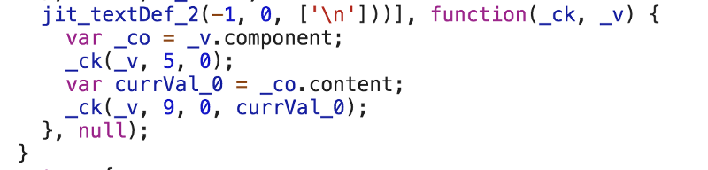

# Полное руководство по стратегии обнаружения изменений Angular onPush

[Статья](https://habr.com/ru/companies/infopulse/articles/358860/)

Перевод

[Автор оригинала: Netanel Basal](https://netbasal.com/a-comprehensive-guide-to-angular-onpush-change-detection-strategy-5bac493074a4)


## Default cтратегия обнаружения изменений

По умолчанию Angular использует **ChangeDetectionStrategy.Default** стратегию обнаружения изменений.

**ChangeDetectionStrategy.Default** работает таким образом, что каждый раз, когда что-то меняется в нашем приложении, в результате различных пользовательских событий, таймеров, XHR, промисов и т.д., обнаружение изменений будет запускаться по всем компонентам.

Можем увидеть это на простом примере. Создадим в компоненте геттер и используем его в нашем шаблоне. Например:

```ts
@Component({
  selector: 'hello',
  template: `
    <h1>Hello {{name}}!</h1>
    {{runChangeDetection}}
  `
})
export class HelloComponent {
  @Input() name: string;
  get runChangeDetection() {
    console.log('Checking the view');
    return true;
  }
}
```

```ts
@Component({
  selector: 'app-root',
  template: `
    <hello></hello>
    <button (click)="onClick()">Trigger change detection</button>
  `
})
export class AppComponent {
  onClick() {}
}
```

Каждый раз, когда мы нажимаем на кнопку, Angular будет запускать цикл обнаружения изменений и в консоли мы увидим два лога “Checking the view” (или один в продакшн моде).

Этот цикл называется грязной проверкой (dirty checking). Суть проверки заключается в том, что Angular сравнивает новые значения со старыми и обновляет представление если они не равны.

Теперь представьте большое приложение с огромным количеством компонентов и множеством условий. Если мы позволим Angular, каждый раз, когда запускается цикл обнаружения изменений, проверять каждое из этих условий, это негативно скажется на производительности.

Не смотря на то, что Angular неплохо оптимизирован, в процессе роста приложения, ему придется работать все больше и больше.

Что, если мы поможем Angular и дадим ему более явные индикаторы, когда нужно проверять наши компоненты?

## OnPush стратегия обнаружения изменений

Мы можем изменить **ChangeDetectionStrategy.Default** на **ChangeDetectionStrategy.OnPush**.

Это означает, что компонент теперь зависит только от **@inputs()** параметров, и будет проверятся только при таких условиях:

#### 1. Изменилась ссылка input параметра

Установив OnPush стратегию, мы как бы подписываем договор с Angular, который обязывает нас работать с иммутабельными объектами (или наблюдаемыми (observables), как мы увидим дальше).

Преимущество работы с иммутабельными данными в контексте обнаружения изменений в том, что Angular выполняет простую проверку по ссылке, чтобы решить, следует ли проверять представление. Это намного быстрее чем глубокое сравнение объектов.

Попробуем мутировать объект и посмотрим на результат:

```ts
@Component({
  selector: 'tooltip',
  template: `
    <h1>{{config.position}}</h1>
    {{runChangeDetection}}
  `,
  changeDetection: ChangeDetectionStrategy.OnPush
})
export class TooltipComponent {
  @Input() config;
  get runChangeDetection() {
    console.log('Checking the view');
    return true;
  }
}
```

```ts
@Component({
  selector: 'app-root',
  template: `
    <tooltip [config]="config"></tooltip>
    <button (click)="onClick()">Click</button>
  `
})
export class AppComponent {
  config = {
    position: 'top'
  };

  onClick() {
    this.config.position = 'bottom';
  }
}
```

После клика на кнопку, мы не увидим никаких логов в консоли. Angular просто сравнил старое и новое значения по ссылке, которая осталась прежней.

```ts
/** Returns false in our case */
if( oldValue !== newValue ) { 
  runChangeDetection();
}
```

Как мы знаем, числа, булевые, строки, null и undefined это примитивные типы. Все примитивные типы передаются по значению. Объекты, массивы, и функции передаются по ссылке.

Чтобы запустить механизм обнаружения изменений, мы должны изменить саму ссылку на объект.

```ts
@Component({
  selector: 'app-root',
  template: `
    <tooltip [config]="config"></tooltip>
    <button (click)="onClick()">Click</button>
  `
})
export class AppComponent {
  config = {
    position: 'top'
  };

  onClick() {
    this.config = {
      position: 'bottom'
    }
  }
}
```

После этого изменения, мы увидим, что представление было проверено и значение изменилось, как мы и ожидали.

#### 2. Событие внутри компонента или его потомках

Компонент может иметь внутреннее состояние, которое обновляется когда возникает событие от самого компонента или его потомков.

Например click:

```ts
@Component({
  template: `
    <button (click)="add()">Add</button>
    {{count}}
  `,
  changeDetection: ChangeDetectionStrategy.OnPush
})
export class CounterComponent {
  count = 0;
  add() {
    this.count++;
  }
}
```

Когда мы жмем на кнопку, Angular запускает цикл обнаружения изменений и представление обновляется, как и ожидалось.

Возможно, вы думаете, что все асинхронные операции также должны быть триггером запуска механизма обнаружения изменений, как мы и говорили вначале, но нет. Правило применяется только к событиям DOM, поэтому следующий код не станет триггером механизма.

```ts
@Component({
  template: `...`,
  changeDetection: ChangeDetectionStrategy.OnPush
})
export class CounterComponent {
  count = 0;

  constructor() {
    setTimeout(() => this.count = 5, 0);

    setInterval(() => this.count = 5, 100);

    Promise.resolve().then(() => this.count = 5); 

    this.http.get('https://count.com').subscribe(res => {
      this.count = res;
    });
  }

  add() {
    this.count++;
  }
}
```

Обратите внимание, что свойство count изменилось, поэтому при следующем цикле обнаружения изменений, когда мы нажмем на кнопку, значение будет 6 (5 + 1).

#### 3. Ручной запуск обнаружения изменений

Angular предоставляет нам три метода для самостоятельного запуска механизма обнаружения изменений и мы можем вызывать их в нужных нам местах.

Первый **detectChanges()** говорит Angular запустить обнаружение изменений в компоненте и его потомках.

```ts
@Component({
  selector: 'counter',
  template: `{{count}}`,
  changeDetection: ChangeDetectionStrategy.OnPush
})
export class CounterComponent { 
  count = 0;

  constructor(private cdr: ChangeDetectorRef) {
    setTimeout(() => {
      this.count = 5;
      this.cdr.detectChanges();
    }, 1000);
  }
}
```

Второй **ApplicationRef.tick()** говорит Angular запустить обнаружение изменений во всем приложении.

```ts
tick() {
  try {
    this._views.forEach((view) => view.detectChanges());
    ...
  } catch (e) {
    ...
  }
}
```

И третий **markForCheck()**, который **не** триггерит запуск обнаружения изменений. Вместо этого он помечает компонент и всех его родителей, что они должны быть проверены в текущем или следующем цикле обнаружения изменений.

```ts
markForCheck(): void { 
  markParentViewsForCheck(this._view); 
}

export function markParentViewsForCheck(view: ViewData) {
  let currView: ViewData|null = view;
  while (currView) {
    if (currView.def.flags & ViewFlags.OnPush) {
      currView.state |= ViewState.ChecksEnabled;
    }
    currView = currView.viewContainerParent || currView.parent;
  }
}
```

Стоит обратить внимание, что ручной запуск механизма обнаружения изменений не является плохой практикой. Использование данных методов вполне по дизайну и допустимо (конечно в необходимых случаях).

## Аngular Async пайп

Async пайп подписывается на наблюдаемый объект или промис и возвращает последнее отданное им значение.

Давайте посмотрим на простой пример компонента с OnPush и наблюдаемым (observable) input параметром.

```ts
@Component({
  selector: 'app-root',
  template: `
    <button (click)="add()">Add</button>
    <app-list [items]="items$"></app-list>
  `
})
export class AppComponent {
  items = [];
  items$ = new BehaviorSubject(this.items);

  add() {
    this.items.push({ title: Math.random() })
    this.items$.next(this.items);
  }
}
```

```ts
@Component({
  selector: 'app-list',
  template: `
    <div *ngFor="let item of _items">{{item.title}}</div>
  `,
  changeDetection: ChangeDetectionStrategy.OnPush
})
export class ListComponent implements OnInit {
  @Input() items: Observable<Item[]>;
  _items: Item[];

  ngOnInit() {
    this.items.subscribe(items => {
      this._items = items;
    });
  }
}
```

После нажатия на кнопку, мы не увидим обновленное представление. Это связано с тем, что ни одно из описанных нами выше условий не произошло. Поэтому Angular не будет проверять компонент в текущем цикле обнаружения изменений.

Теперь давайте используем async пайп.

```ts
@Component({
  template: `
    <div *ngFor="let item of items | async">{{item.title}}</div>
  `,
  changeDetection: ChangeDetectionStrategy.OnPush
})
export class ListComponent implements OnInit {
  @Input() items;
}
```

Как видим, теперь представление обновляется. Когда приходит новое значение, async пайп отмечает компонент как необходимый к проверке. Можем видеть это в [исходниках](https://github.com/angular/angular/blob/5.2.10/packages/common/src/pipes/async_pipe.ts#L139):

```ts
private _updateLatestValue(async: any, value: Object): void {
  if (async === this._obj) {
    this._latestValue = value;
    this._ref.markForCheck();
  }
}
```

Angular вызывает **markForCheck()**, поэтому представление обновляется даже когда ссылки не изменились.

Если компонент зависит только от входящих параметров, и они наблюдаемы, то этот компонент может изменится только если один из параметров генерирует событие.

Совет: Антипаттерном считается отдавать во внешний мир subject, лучше всегда отдавать наблюдаемый объект, используя asObservable() метод.

## OnPush и шаблонные переменные

Рассмотрим следующие компоненты:

```ts
@Component({
  selector: 'app-tabs',
  template: `<ng-content></ng-content>`
})
export class TabsComponent implements OnInit {
  @ContentChild(TabComponent) tab: TabComponent;

  ngAfterContentInit() {
    setTimeout(() => {
      this.tab.content = 'Content'; 
    }, 3000);
  }
}
```

```ts
@Component({
  selector: 'app-tab',
  template: `{{content}}`,
  changeDetection: ChangeDetectionStrategy.OnPush
})
export class TabComponent {
  @Input() content;
}
```

```ts
<app-tabs>
  <app-tab></app-tab>
</app-tabs>
```

Вероятно, вы думаете, что Angular через 3 секунды обновит представление app-tab компонента новым значением.

Мы же видели что если обновить ссылку в OnPush компоненте, это должно запустить механизм обнаружения изменений, не так ли?

К сожалению, в данном примере это не работает. Angular не знает, что мы обновили свойство в app-tab компоненте. Только определив input параметр в шаблоне, Angular поймет, что это свойство нужно проверить в следующем цикле обнаружения изменений.

Например:

```html
<app-tabs>
  <app-tab [content]="content"></app-tab>
</app-tabs>
```

Поскольку мы явно определили input параметр в шаблоне, Angular создаст **updateRenderer()** функцию, которая отслеживает изменения значений параметров в каждом цикле обнаружения изменений.



AppComponent.ngfactory.ts

Простым решением в этом случае будет создание сеттера и вызов **markForCheck()**.

```ts
@Component({
  selector: 'app-tab',
  template: `{{_content}}`,
  changeDetection: ChangeDetectionStrategy.OnPush
})
export class TabComponent {
  _content;

  @Input() set content(value) {
    this._content = value;
    this.cdr.markForCheck();
  }

  constructor(private cdr: ChangeDetectorRef) {}
}
```

## === onPush++

После того как мы поняли (надеюсь) всю мощь OnPush, мы можем создавать более оптимизированные приложения. Чем больше компонентов с OnPush стратегией мы имеем, тем меньше проверок будет выполнять сам Angular. Рассмотрим реальный пример:

Допустим у нас есть todos компонент, в котором определено свойство todos с декоратором Input.

```ts
@Component({
  selector: 'app-todos',
  template: `
     <div *ngFor="let todo of todos">
       {{todo.title}} - {{runChangeDetection}}
     </div>
  `,
  changeDetection: ChangeDetectionStrategy.OnPush
})
export class TodosComponent {
  @Input() todos;

  get runChangeDetection() {
    console.log('TodosComponent - Checking the view');
    return true;
  }
}
```

```ts
@Component({
  template: `
    <button (click)="add()">Add</button>
    <app-todos [todos]="todos"></app-todos>
  `
})
export class AppComponent {
  todos = [{ title: 'One' }, { title: 'Two' }];

  add() {
    this.todos = [...this.todos, { title: 'Three' }];
  }
}
```

Недостатком данного примера является то, что при нажатии кнопки Add, Angular будет проверять на изменения каждое todo. И при первом нажатии мы увидим в консоли три лога.

В примере выше делается только одна проверка, но представьте себе компонент из реального большого приложения, с несколькими условиями и привязками данных (ngIf, ngClass, выражения, и т.д.). Это может существенно влиять на производительность.

*Мы запускаем обнаружение изменений без причин*

Эффективным решением будет создать компонент с OnPush стратегией для конкретного todo. Например:

```ts
@Component({
  selector: 'app-todos',
  template: `
    <app-todo [todo]="todo" *ngFor="let todo of todos"></app-todo>
  `,
  changeDetection: ChangeDetectionStrategy.OnPush
})
export class TodosComponent {
  @Input() todos;
}
```

```ts
@Component({
  selector: 'app-todo',
  template: `{{todo.title}} {{runChangeDetection}}`,
  changeDetection: ChangeDetectionStrategy.OnPush
})
export class TodoComponent {
  @Input() todo;

  get runChangeDetection() {
    console.log('TodoComponent - Checking the view');
    return true;
  }
}
```

Теперь при клике на кнопку, мы увидим только один лог. Поскольку ни один input параметр других todo не изменился, их представление не будет проверятся.

Также логическое разделение компонентов сделает ваш код более читабельным и переиспользуемым.

**Теги:** 

- [Angular](https://habr.com/ru/search/?target_type=posts&order=relevance&q=[Angular])
- [typescript](https://habr.com/ru/search/?target_type=posts&order=relevance&q=[typescript])

