# Грокаем Алгоритмы

1. Сортировка выбором
1. Рекурсия
1. Быстрая сортировка
1. Хеш-таблицы
1. Поиск в ширину
1. Алгоритм Дейкстры
1. Жадные алгоритмы
1. Динамическое программирование
1. Алгоритм k ближайших соседей


**Для кого предназначена эта книга?**

- программисты-самоучки;

- студенты, начавшие изучать программирование;

- выпускники, желающие освежить память;

- специалисты по физике/математике/другим дисциплинам, интересующиеся программированием.


## «О-большое»

Специальная нотация «О-большое» описывает скорость работы алгоритма.

### Время выполнения алгоритмов растет с разной скоростью

Время выполнения для бинарного и простого поиска растет с разной скоростью.

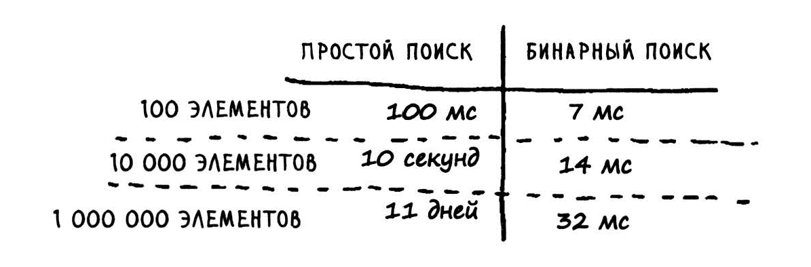

Другими словами, с увеличением количества элементов бинарный поиск занимает чуть больше времени. А простой поиск займет гораздо больше времени.

«О-большое» описывает, насколько быстро работает алгоритм.


Такая запись сообщает количество операций, которые придется выполнить алгоритму. Она называется «О-большое», потому что перед количеством операций ставится символ «О» (а большое - потому что в верхнем регистре).


### «О-большое» определяет время выполнения в худшем случае

Предположим, вы используете простой поиск для поиска фамилии в телефонной книге. Вы знаете, что простой поиск выполняется за время О(n), то есть в худшем случае вам придется просмотреть каждую без исключения запись в телефонной книге. Но представьте , что искомая фамилия начинается на букву «А» и этот человек стоит на самом первом месте в вашей телефонной книге. В общем, вам не пришлось просматривать все записи - вы нашли нужную фамилию с первой попытки. Отработал ли алгоритм за время О(n)? А может, он занял время О(1), потому что результат был получен с первой попытки?

Простой поиск все равно выполняется за время О(n). Просто в данном случае вы нашли нужное значение моментально; это лучший возможный случай. Однако «О-большое» описывает худший возможный случай. Фактически вы утверждаете, что в худшем случае придется просмотреть каждую запись в телефонной книге по одному разу. Это и есть время О(n). И это дает определенные гарантии - вы знаете, что простой поиск никогда не будет работать медленнее О(n).


## Задача о коммивояжере

...


## Бинарный поиск

**Бинарный поиск** - это алгоритм; на входе он получает отсортированный список элементов. Если элемент, который вы ищете, присутствует в списке, то бинарный поиск возвращает ту позицию, в которой он был найден. В противном случае бинарный поиск возвращает null.

Бинарный поиск работает только в том случае, если список отсортирован.

Рассмотрим пример того, как работает бинарный поиск. 

### Простой поиск

Сыграем в простую игру: я загадал число от 1 до 100. Вы должны отгадать мое число, использовав как можно меньше попыток. При каждой попытке я буду давать один из трех ответов: «мало», «много» или «угадал».

Предположим, вы начинаете перебирать все варианты подряд: 1, 2, 3, 4... Вот как это будет выглядеть.


Это пример простого поиска (возможно, термин «тупой поиск» был бы уместнее). При каждой догадке исключается только одно число. Если я за­гадал число 99, то, чтобы добраться до него, потребуется 99 попыток!

### Более эффективный поиск (Бинарный поиск)

Существует другой, более эффективный способ. Начнем с 50.


Слишком мало ... но вы только что исключили половину чисел! Теперь вы знаете, что все числа 1-50 меньше загаданного. Следующая попытка: 75.


На этот раз перелет ... Но вы снова исключили половину оставшихся чисел! ***С бинарным поиском вы каждый раз загадываете число в середине диапазона и исключаете половину оставшихся чисел.*** Следующим будет число 63 (по середине между 50 и 75).

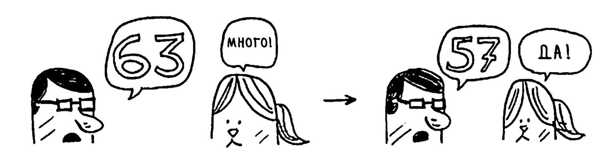


Попробуем поточнее определить, сколько чисел будет исключаться каждый раз.

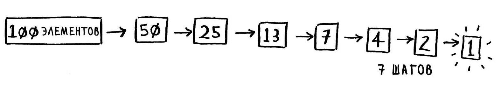

**При бинарном поиске каждый раз исключается половина чисел**

Какое бы число я ни задумал, вы гарантированно сможете угадать его не более чем за 7 попыток, потому что с каждой попыткой исключается половина оставшихся чисел!

Предположим, вы ищете слово в словаре с 240 000 словами. При простом поиске может потребоваться 240 000 попыток, если искомое слово находится на самой последней позиции в книге. С каждым шагом бинарного поиска количество слов сокращается вдвое, пока не останется только одно слово.

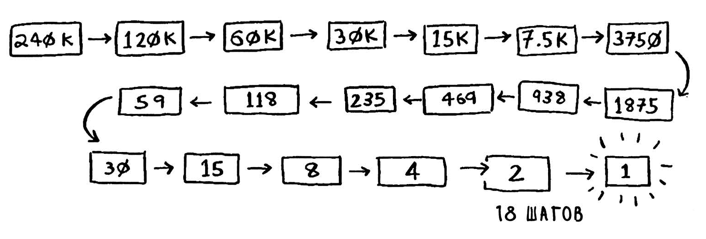

Итак, бинарный поиск потребует 18 шагов - заметная разница! В общем случае для списка из *n* элементов бинарный поиск выполняется за *log2 n* шагов, тогда как простой поиск будет выполнен за *n* шагов.


------

### Пример кода

Посмотрим, как написать реализацию бинарного поиска на Python

Функция binary_search получает отсортированный массив и значение. Если значение присутствует в массиве, то функция возвращает его позицию. При этом мы должны следить за тем, в какой части массива проводится поиск. Вначале это весь массив:

```python
low = 0
high = len(list) - 1
```


Каждый раз алгоритм проверяет средний элемент:

```python
mid = (low + high) / 2
guess = list[mid]
```

**Если значение (low+high) нечетно, то Python автоматически округляет значение mid в меньшую сторону*

Если названное число было слишком мало, то переменная **low** обновляется
соответственно:

```python
if guess < item :
	low = mid + 1
```


А если догадка была слишком велика, то обновляется переменная **high**. Полный
код выглядит так:


```python
def binary_search(list, item):
	low = 0
	high = len(list)-1
    
	while low <= high:
        mid = (low + high)
        guess = list[mid]
        if guess == item:
			return mid
		if guess > item:
			high = mid - 1
		else:
			low = mid + 1
	return None

my_list = [1, 3, 5, 7, 9]

print binary_search(my_list, 3) # => 1
print binary_search(my_list, -1) # => None
```

### Время выполнения

Обычно следует выбирать самый эффективный алгоритм, будь то оптимизация по времени или памяти.

В первом варианте мы последовательно проверяли каждое число, одно за другим. Если список состоит из 100 чисел, может потребоваться до 100 попыток. Для списка из 4 миллиардов чисел потребуется до 4 миллиардов попыток. Таким образом, максимальное количество попыток совпадает с размером списка. Такое время выполнения называется линейным.

С бинарным поиском дело обстоит иначе. Если список состоит из 100 элементов, потребуется не более 7 попыток. Для списка из 4 миллиардов эле ментов потребуется не более 32 попыток. Бинарный поиск выполняется за логарифмическое время. В следующей таблице при водится краткая сводка результатов.


## Сортировка выбором

Допустим, у вас на компьютере записана музыка и для каждого исполнителя хранится счетчик воспроизведений.


Вы хотите отсортировать список по убыванию счетчика воспроизведений.

Одно из возможных решений - пройти по списку и найти исполнителя с наибольшим количеством воспроизведений. Этот исполнитель добавляется в новый список.

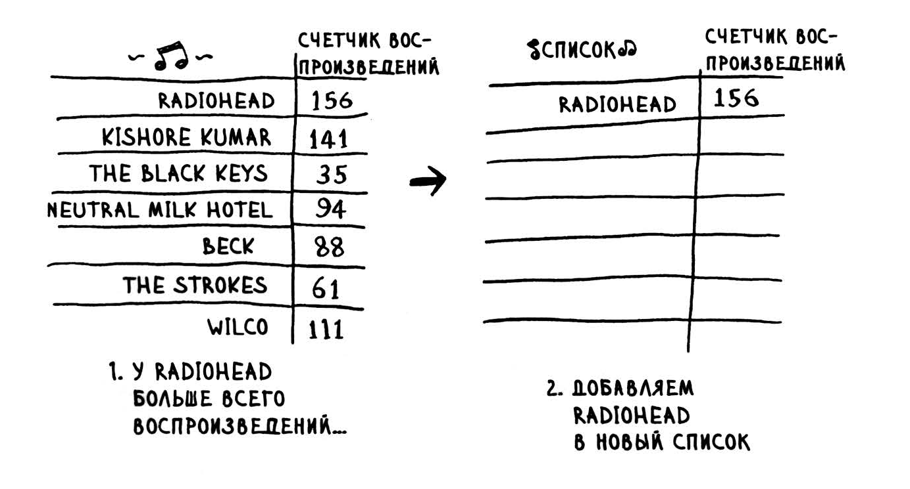

Потом то же самое происходит со следующим по количеству воспроизведений исполнителем.

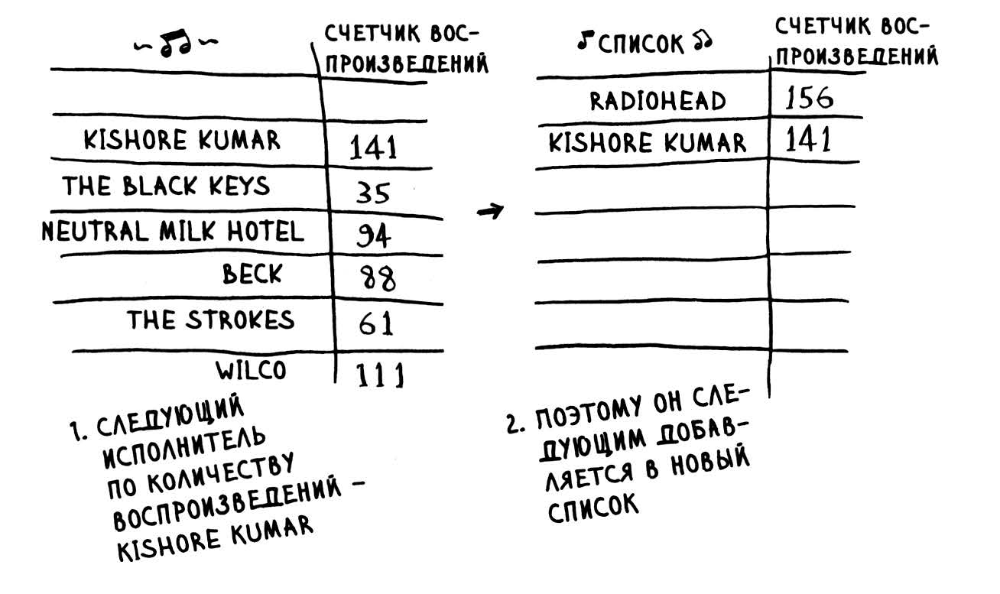

Продолжая действовать так, мы получаем отсортированный список.


А теперь попробуем оценить происходящее с точки зрения теории вычислений и посмотрим, сколько времени будут занимать операции.

Чтобы найти исполнителя с наибольшим значением счетчика воспроизведения, необходимо проверить каждый элемент в списке. Это делается за время О(n). Итак, имеется операция, выполняемая за время О(n), и ее необходимо выполнить **n** раз.

**Алгоритм сортировки выбором легко объясняется, но медленно работает.**

Массивы прекрасно подходят для чтения элементов в произвольных позициях, потому что обращение
к любому элементу в массиве происходит мгновенно. В связанном списке элементы не хранятся рядом друг с другом, поэтому мгновенно определить позицию i-го элемента в памяти невозможно - нужно обратиться к первому элементу, чтобы получить адрес второго элемента, затем обратиться ко второму элементу для получения адреса третьего - и так далее, пока вы не доберетесь до i-го.

### Пример кода

```python
def findSmallest(a r r):
	smallest = arr[0]
    smallest_index = 0
    for i in range(l, len(arr)):
		if arr[i] < smallest:
		smallest = arr[i]
		smallest_index = i
	return smallest_index


def selectionSort(arr):
	newArr = []
	for i in range(len(arr)):
        smallest = findSmallest(arr)
        newArr.append(arr.pop(smallest))
	return newArr


print selectionSort([S, З, 6, 2, 10])
```


### Время выполнения

О(n)

### Шпаргалка

- Память компьютера напоминает огромный шкаф с ящиками.
- Если вам потребуется сохранить набор элементов, воспользуйтесь массивом или списком.
- В массиве все элементы хранятся в памяти рядом друг с другом.
- В списке элементы распределяются в произвольных местах памяти, при этом в одном элементе хранится адрес следующего элемента.
- Массивы обеспечивают быстрое чтение.
- Списки обеспечивают быструю вставку и выполнение.
- Все элементы массива должны быть однотипными (только целые числа,только вещественные числа и т. д.).


------

## Массивы и связанные списки

Всего существуют два вида доступа: *произвольный* и *последовательный*. При последовательном
доступе элементы читаются по одному, начиная с первого. Связанные списки поддерживают только последовательный доступ. Если вы захотите прочитать 10-й элемент связанного списка, вам придется прочитать первые 9 элементов и перейти по ссылкам к 10-му элементу. Массивы обладают более высокой скоростью чтения; это объясняется тем, что они поддерживают произвольный доступ. Многие реальные ситуации требуют произвольного доступа, поэтому массивы часто применяются на практике.


### Связанные списки

При использовании связанного списка элементы могут размещаться где угодно в памяти.


В каждом элементе хранится адрес следующего элемента списка . Таким образом, набор произвольных адресов памяти объединяется в цепочку.


Все как в игре «Найди клад». Вы приходите по первому адресу, там написано: «Следующий элемент находится по адресу 123». Вы идете по адресу 123, там написано : «Следующий элемент находится по адресу 847» и т. д. Добавить новый элемент в связанный список проще простого: просто разместите
его по любому адресу памяти и сохраните этот адрес в предыдущем элементе.

Если необходимое место есть в памяти, вы сможете сохранить данные в связанном списке.

### Массивы

Работая с массивом, вы заранее знаете адрес каждого его элемента. Допустим , массив содержит пять элементов и вы знаете, что он начинается с адреса 00.


Массивы прекрасно подходят для чтения элементов в произвольных позициях, потому что обращение
к любому элементу в массиве происходит мгновенно. В связанном списке элементы не хранятся рядом друг с другом, поэтому мгновенно определить позицию i-го элемента в памяти невозможно - нужно обратиться к первому элементу, чтобы получить адрес второго элемента, затем обратиться ко второму элементу для получения адреса третьего - и так далее, пока вы не доберетесь до i-го.

### Гибридная структуру данных: массив связанных списков.

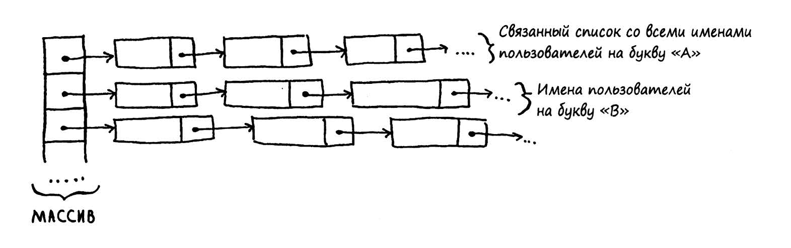


## Рекурсия

Рекурсией называется вызов функцией самой себя.

```python
def countdown(i):
	countdown(i-1) # <--- рекурсия
```

### Базовый случай и рекурсивный случаи

Так как рекурсивная функция вызывает сама себя, программисту легко ошибиться и написать функцию так, что возникнет бесконечный цикл.

Когда вы пишете рекурсивную функцию , в ней необходимо указать, в какой момент следует прервать рекурсию. Вот почему **каждая рекурсивная функция состоит из двух частей: базового случая и рекурсивного случая**. В рекурсивном случае функция вызывает сама себя. В базовом случае функция себя не вызывает... чтобы предотвратить зацикливание.

```python
def countdown(i):
    print i
    if i <= 0: # <--- Базовый случай
	    return
    else: # <--- Рекурсивный случай
    	countdown(i-1)
```

Зачем применять рекурсию, если задача легко решается с циклом? В языках функционального программирования, таких как Haskell, циклов нет, поэтому для написания подобных функций приходится применять рекурсию.

### Стек

**Стек** (от англ. stack — стопка) — **структура данных**, представляющая из себя упорядоченный набор элементов, в которой добавление новых элементов и удаление существующих производится с одного конца, называемого вершиной **стека**.

Стек — это коллекция, элементы которой получают по принципу «последний вошел, первый вышел» *(Last-In-First-Out или LIFO)*

### Стек вызовов

Во внутренней работе вашего компьютера используется стек, называемый *стеком вызовов*.

Предположим, в программе используется вызов **greet( "maggie")**. Сначала ваш компьютер выделяет блок памяти для этого вызова функции.


Затем эта память используется. Переменной **name** присваивается значение **"maggie"**; оно должно быть сохранено в памяти.


Каждый раз , когда вы вызываете функцию , компьютер сохраняет в памяти значения всех переменных для этого вызова. Далее выводится приветствие **hello, maggie!** , после чего следует второй вызов **greet2("maggie")**. И снова компьютер выделяет блок памяти для вызова функции.


Ваш компьютер объединяет эти блоки в стек. Второй блок создается над первым. Вы выводите сообщение **how are you, maggie?**, после чего возвращаете управление из вызова функции. Когда это происходит, блок на вершине стека извлекается из него .


Теперь верхний блок в стеке относится к функции **greet**; это означает, что вы вернулись к функции greet. При вызове функции **greet2** функция **greet** *еще не была завершена*. Здесь-то и скрывается истинный смысл этого раздела: *когда вы вызываете функцию из другой функции, вызывающая функция приостанавливается в частично завершенном состоянии*. Все значения переменных этой функции остаются в памяти. А когда выполнение функции **greet2** будет завершено, вы вернетесь к функции **greet** и продолжите ее выполнение с того места, где оно прервалось. Сначала выводится сообщение **getting ready to say bуе ...** , после чего вызывается функция **bуе**.


Блок для этой функции добавляется на вершину стека. Далее выводится сообщение **ok bуе!** с выходом из вызова функции.


Управление снова возвращается функции **greet**. Делать больше нечего, так что управление возвращается и из функции **greet**. Этот стек, в котором сохранялись переменные разных функций, называется ***стеком вызовов***.


```python
def fact(x):
	if х == 1:
		return 1
	else:
		return х * fact(x-1)
```

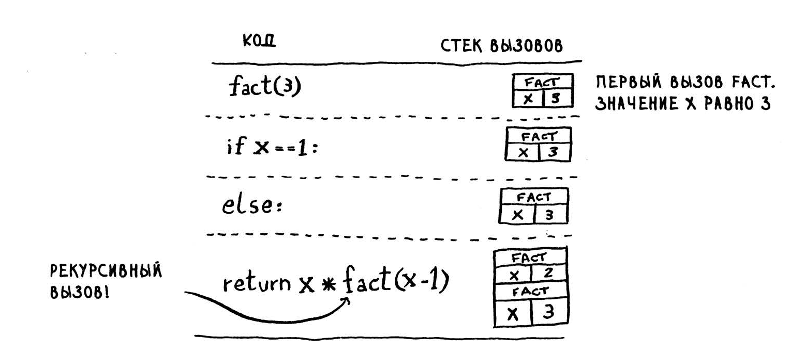

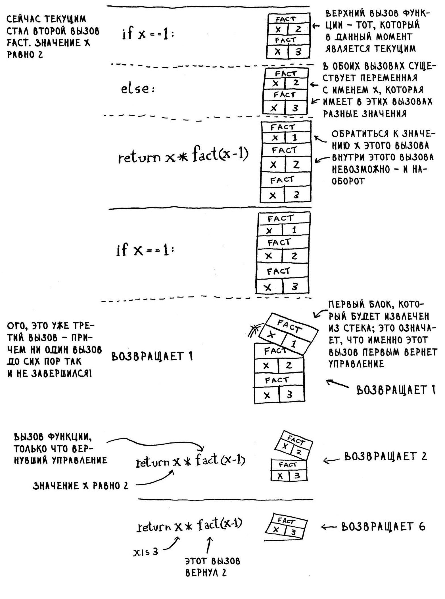

### Шпаргалка
- Когда функция вызывает саму себя, это называется рекурсией.
- В каждой рекурсивной функции должно быть два случая: базовый и рекурсивный .
- Стек поддерживает две операции: занесение и извлечение элементов.
- Все вызовы функций сохраняются в стеке вызовов.
- Если стек вызовов станет очень большим, он займет слишком много памяти.


## Разделяй и властвуй

Решение задачи методом *разделяй и властвуй* состоит из двух шагов:
1. Сначала определяется **базовый случай**. Это должен быть простейший
случай из всех возможных.
2. Задача **делится или сокращается** до тех пор, пока не будет сведена к базовому
случаю .

### **Пример**

[2, 4, 6] Имеется массив чисел.

Нужно просуммировать все числа и вернуть сумму.

1. Определить базовый случай. Если будет массив с 0 или 1 элементом, он суммируется достаточно просто.


2. Каждый рекурсивный вызов должен приближать вас к пустому массиву. Как уменьшить размер задачи? Один из возможных способов:
    

  Функция sum может работать по следующей схеме:

  

  А вот как это выглядит в действии.

  

  При рекурсии сохраняется состояние.

  

### Совет

Когда вы пишете рекурсивную функцию, в которой задействован массив, базовым случаем часто оказывается пустой массив или массив из одного элемента. Если вы не знаете, с чего начать, - начните с этого.

## Быстрая сортировка

Алгоритм быстрой сортировки работает так: сначала в массиве выбирается элемент, который называется опорным. Предположим, что опорным становится первый элемент массива (Лучший вариант опорного элемента - средний элемент).


Находим элементы, меньшие опорного, и элементы, большие опорного.


Этот процесс называется разделением. Теперь у нас имеются :

- подмассив всех элементов, меньших опорного;
- опорный элемент;
- подмассив всех элементов, больших опорного.

Как отсортировать подмассивы? Базовый случай быстрой сортировки уже знает, как сортировать массивы из двух элементов (левый подмассив) и пустые массивы (правый подмассив). Следовательно, если применить алгоритм быстрой сортировки к двум подмассивам, а затем объединить результаты, получится отсортированный массив!

Допустим, имеется массив из пяти элементов.


Вот как выглядят все варианты разделения этого массива в зависимости от выбранного опорного элемента:


Независимо от выбора опорного элемента вы можете рекурсивно вызывать быструю сортировку для двух подмассивов. Например, предположим, что в качестве опорного выбирается элемент 3. Вы применяете быструю сортировку к подмассивам.


### Средний и худший случай

Алгоритм быстрой сортировки уникален тем, что его скорость зависит от выбора опорного элемента.

Быстродействие быстрой сортировки сильно зависит от выбора опорного элемента. Предположим, опорным всегда выбирается первый элемент, а быстрая сортировка применяется к уже отсортированному массиву. Быстрая сортировка не проверяет, отсортирован входной массив или нет, и все равно пытается его отсортировать.

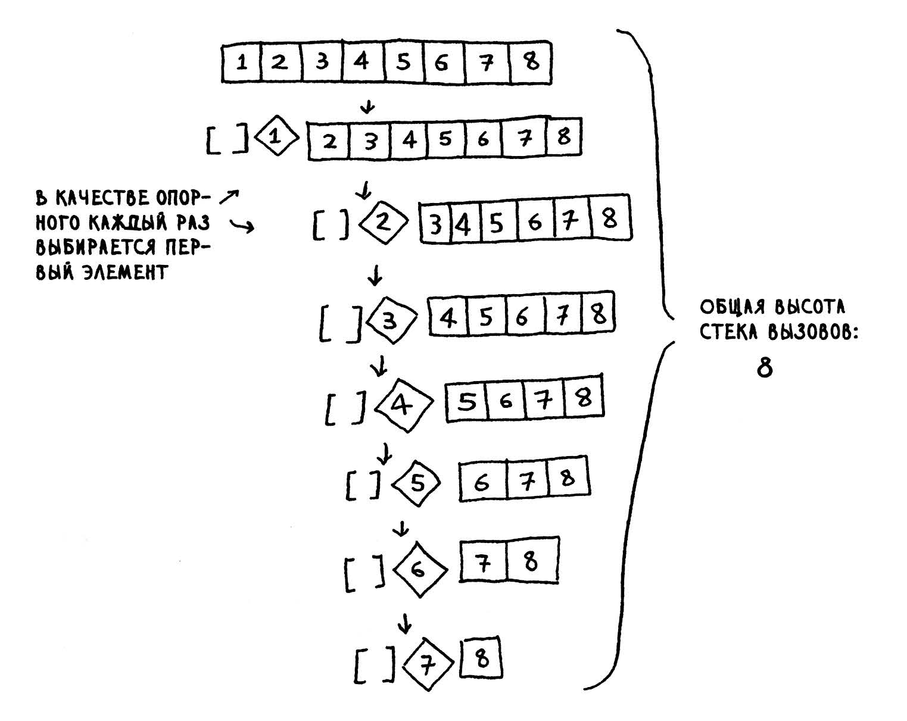

Обратите внимание: на этот раз массив не разделяется на две половины. Вместо этого один из двух подмассивов всегда пуст, так что стек вызовов получается очень длинным. Теперь предположим, что в качестве опорного всегда выбирается средний элемент. Посмотрим, как выглядит стек вызовов в этом случае.


Стек намного короче! Массив каждый раз делится надвое, поэтому такое количество рекурсивных вызовов излишне. Вы быстрее добираетесь до базового случая, и стек вызовов получается более коротким. 

Первый из рассмотренных примеров описывает худший сценарий, а второй лучший. В худшем случае размер стека описывается как O(n). В лучшем случае он составит O(log n).

**Лучший случай также является средним**. Если вы всегда будете выбирать опорным элементом случайный элемент в массиве, быстрая сортировка в среднем завершится за время О(n log n). Это один из самых быстрых существующих алгоритмов сортировки, который заодно является хорошим примером стратегии «разделяй и властвуй».

## Хеш-таблицы

### Хеш-функции

Хеш-функция представляет собой функцию, которая получает строку (Под ~строкой» в данном случае следует понимать любые данные - последовательность байтов) и возвращает число:


Хеш-функция должна соответствовать некоторым требованиям:

- Она должна быть последовательной. Допустим, вы передали ей строку «апельсины1> и получили 4. Это значит, что каждый раз в будущем, передавая ей строку «апельсины», вы будете получать 4. Без этого хеш-таблица бесполезна.
- Разным словам должны соответствовать разные числа. Например, хеш-функция, которая возвращает 1 для каждого полученного слова, никуда не годится. В идеале каждое входное слово должно отображаться на свое число.


Начнем с пустого массива:


Все цены будут храниться в этом массиве; передадим хеш-функции строку «апельсины».


Хеш-функция выдает значение «3». Сохраним цену апельсинов в элементе массива с индексом 3.


Добавим молоко. Передадим хеш-функции строку «молоко».


со временем весь массив будет заполнен ценами на товары.


А теперь вы спрашиваете: сколько стоит авокадо? Искать в массиве ничего не нужно, просто передайте строку «авокадо» хеш-функции.


Результат показывает, что значение хранится в элементе с индексом 4. И оно, конечно, там и находится!


Хеш-функция сообщает, где хранится цена, и вам вообще не нужно ничего искать! Такое решение работает, потому что:

- Хеш-функция неизменно связывает название с одним индексом . Каждый раз, когда она вызывается для строки «авокадо», вы получаете обратно одно и то же число. При первом вызове этой функции вы узнаете, где следует сохранить цену авокадо, а при последующих вызовах она сообщает, где взять эту цену.
- Хеш-функция связывает разные строки с разными индексами. «Авокадо» связывается с индексом 4, а «молоко» - с индексом 0. Для каждой строки находится отдельная позиция массива, в которой сохраняется цена этого товара.
- Хеш-функция знает размер массива и возвращает только действительные индексы. Таким образом, если длина массива равна 5 элементам, хеш-функция не вернет 100, потому что это значение не является действительным индексом в массиве.

Свяжите воедино хеш-функцию и массив, и вы получите структуру данных, которая называется **хеш-таблицей**.Они также известны под другими названиями: «ассоциативны е массивы» , «словари», «отображения», «хеш-карты» или просто « хеши ». Хеш-таблицы исключительно быстро работают!


В Python тоже есть хеш-таблицы; они называются словарями. Новая хеш-таблица создается функцией dict:

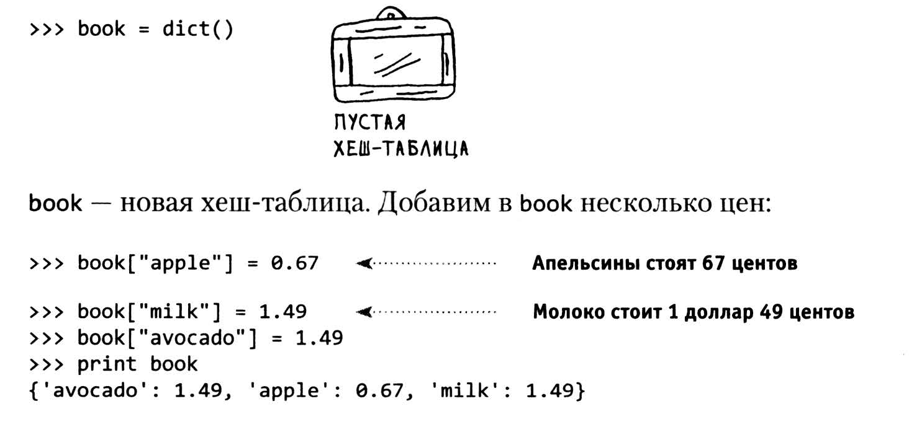

Пока все просто! А теперь запросим цену авокадо:


Хеш-таблица состоит из ключей и значений. В хеше book имена продуктов являются ключами, а цены - значениями. Хеш-таблица связывает ключи со значениями.

### Коллизии

Допустим, массив состоит всего из 33 ячеек. 

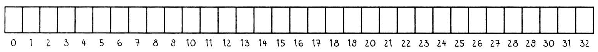

И хеш-функция очень простая: элемент массива просто назначается по алфавитному признаку.

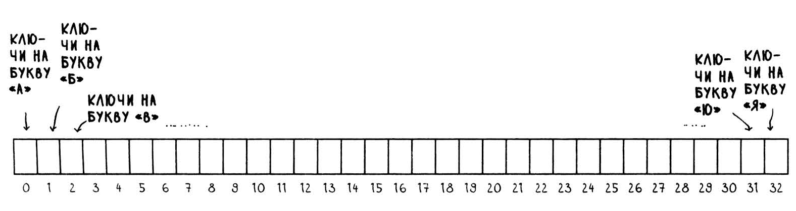

Вы хотите поместить цену апельсинов в хеш. Для этого выделяется первая ячейка.


После апельсинов в хеш заносится цена бананов. Для бананов выделяется вторая ячейка.


Пока все прекрасно! Но теперь в хеш нужно включить цену авокадо. И для авокадо снова выделяется первая ячейка.


О нет! Элемент уже занят апельсинами! Что же делать? Такая ситуация называется коллизией: двум ключам назначается один элемент массива. Возникает проблема: если сохранить в этом элементе цену авокадо, то она запишется на место цены апельсинов. И когда кто-нибудь спросит, сколько стоят апельсины, вы вместо этого сообщите цену авокадо!


Существует много разных стратегий обработки коллизий. Простейшая из них выглядит так: если несколько ключей отображаются на один элемент, в этом элементе создается связанный список.


В этом примере и «апельсины», и «авокадо» отображаются на один элемент массива, поэтому в элементе создается связанный список. Если вам потребуется узнать цену бананов, эта операция по-прежнему выполнится быстро. Если потребуется узнать цену апельсинов, работа пойдет чуть медленнее. Вам придется провести поиск по связанному списку, чтобы найти в нем «апельсины». Если связанный список мал, это не так страшно - поиск будет ограничен тремя или четырьмя элементами. Но предположим, что
вы работаете в специализированной лавке, в которой продаются только продукты на букву «а».

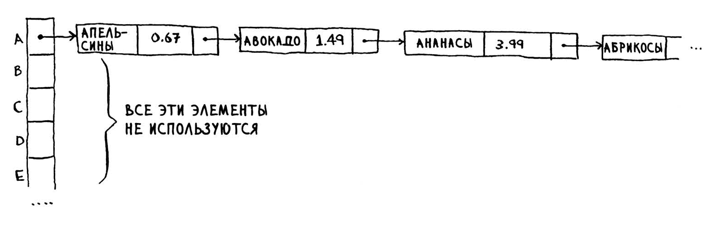

Одну минуту! Вся хеш-таблица полностью пуста, кроме одной ячейки. И эта ячейка содержит огромный связанный список! Каждый элемент этой хеш-таблицы хранится в связанном списке. Ситуация ничуть не лучше той, когда все данные сразу хранятся в связанном списке. Работа с данными замедляется.

Из этого примера следуют два важных урока:

- выбор хеш-функции действительно важен. Хеш-функция, отображающая все ключи на один элемент массива, никуда не годится. В идеале хеш-функция должна распределять ключи равномерно по всему хешу;
- если связанные списки становятся слишком длинными, работа с хеш-таблицей сильно замедляется. Но они не станут слишком длинными при использовании хорошей хеш-функции!

Хорошая хеш-функция создает минимальное число коллизий.

### Быстродействие


В среднем хеш-таблицы выполняют любые операции за время O(1). Время O( 1) называется постоянным.

Получение элемента из массива тоже выполняется за постоянное время. От размера массива оно не зависит. В среднем случае хеш-таблицы работают действительно быстро.

В худшем случае все операции с хеш-таблицей выполняются за время О(n) (линейное время), а это очень медленно. Сравним хеш-таблицы с массивами и списками.


При поиске хеш-таблицы не уступают в скорости массивам (получение значения по индексу). А при вставке и удалении они так же быстры, как и связанные списки. Но в худшем случае хеш-таблицы медленно выполняют все эти операции, поэтому очень важно избегать худшего случая быстродействия при работе с хеш-таблицами. А для этого следует избегать коллизий. Для предотвращения коллизий необходимы:

- низкий коэффициент заполнения;
- хорошая хеш-функция.

### Коэффициент заполнения


Коэффициент заполнения больше 1 означает, что количество товаров превышает количество элементов в массиве.

С ростом коэффициента заполнения в хеш-таблицу приходится добавлять новые элементы, то есть изменять ее размер. Расширение начинается с создания нового массива большего размера. Обычно в таком случае создается массив вдвое большего размера.С меньшим коэффициентом загрузки число коллизий уменьшается, и ваша таблица начинает работать более эффективно. Хорошее приближенное правило: изменяйте размер хеш-таблицы, когда коэффициент заполнения превышает 0,7.Да, изменение размеров требует значительных затрат ресурсов, поэтому оно не должно происходить слишком часто.
В среднем хеш-таблицы работают за время O(1) даже с изменением размеров.

### Хорошая хеш-функция

Хорошая хеш-функция должна обеспечивать равномерное распределение значений в массиве.


Плохая хеш-функция создает скопления и порождает множество коллизий.


### Шпаргалка

- Хеш-таблица создается объединением хеш-функции с массивом.
- Коллизии нежелательны. Хеш -функция должна свести количество коллизий к минимуму.
- Хеш-таблицы обеспечивают очень быстрое выполнение поиска, вставки и удаления.
-  Хеш-таблицы хорошо подходят для моделирования отношений между объектами.
- Как только коэффициент заполнения превышает 0,7, пора изменять размер хеш-таблицы .
- Хеш-таблицы используются для кэширования данных (например, на веб-серверах ).
- Хеш-таблицы хорошо подходят для обнаружения дубликатов.

## Поиск в ширину

(BFS, Breadth-First Search).

Поиск в ширину позволяет найти кратчайшее расстояние между двумя объектами. Однако сам термин «кратчайшее расстояние» может иметь много разных значений! Например, с помощью поиска в ширину можно: 

- написать программу для игры в шашки, которая вычисляет кратчайший путь к победе;
- реализовать проверку правописания (минимальное количество изменений, преобразующих ошибочно написанное слово в правильное, например АЛГОРИФМ ->АЛГОРИТМ - одно изменение);
- найти ближайшего к вам врача.

### Знакомство с графами

Чтобы найти кратчайший путь, нам придется выполнить два шага:

1. Смоделировать задачу в виде графа.
2. Решить задачу методом поиска в ширину.

Алгоритм для решения задачи поиска кратчайшего пути называется *поиском в ширину* .

### Что такое граф?

Граф моделирует набор связей. Представьте, что вы с друзьями играете в покер и хотите смоделировать, кто кому сейчас должен. Алекс должен Раме, Том должен Адиту и т. д. 


Каждый граф состоит из **узлов** и **ребер**.


Узел может быть напрямую соединен с несколькими другими узлами. Эти узлы называются **соседями**.

Графы используются для моделирования связей между разными объектами.

### Поиск в ширину

Поиск в ширину относится к категории алгоритмов поиска, но этот алгоритм работает с графами. Он помогает ответить на вопросы двух типов:

- тип 1: существует ли путь от узла А к узлу В?
- тип 2: как выглядит кратчайший путь от узла А к узлу В?

Поиск происходит вполне тривиально. Сначала нужно построить список для поиска. Теперь нужно обратиться к каждому пункту в списке и проверить, удовлетворяет ли пункт необходимому условию.

Предположим, ни один из пунктов не удовлетворяет условию. Теперь поиск продолжается среди соседних узлов. Каждый раз, когда вы проверяете пункт из списка, вы добавляете в список всех его соседей.

Такой алгоритм и называется поиском в ширину.

### Поиск кратчайшего пути

Будем считать, что пункты массива для начального поиска - это связи первого уровня, а соседи - связи
второго уровня. Связи первого уровня предпочтительнее связей второго уровня, связи второго уровня предпочтительнее связей третьего уровня и т. д. Отсюда следует, что поиск по пунктам второго уровня не должен производиться, пока вы не будете полностью уверены в том, что среди связей первого уровня нет ни одного подходящего пункта.

Также можно объяснить это иначе: связи первого уровня добавляются в список поиска раньше связей второго уровня.

Поиск в ширину находит не только путь из А в В, но и кратчайший путь.

Проверять связи нужно в порядке их добавления. Для операций такого рода существует специальная структура данных, которая называется **очередью**.

### Очереди

Очередь работает точно так же, как и в реальной жизни.

Вы не можете обращаться к произвольным элементам очереди. Вместо этого поддерживаются всего две операции: *постановка в очередь* и *извлечение из очереди*.


Очередь относится к категории структур данных FIFO: First In, First Out («первым вошел, первым вышел»). А стек принадлежит к числу структур данных LIFO: Last In, First Out («последним пришел , первым вышел»).


### Реализация графа

Для начала необходимо реализовать граф на программном уровне . Граф состоит из нескольких узлов. И каждый узел соединяется с соседними узлами. Как выразить от ношение типа «вы - > боб»? К счастью, вам
уже известна структура данных, способная выражать отношения: **хеш-таблица**!

```python
graph = {}
graph["you"] = ["alice", "ЬоЬ", "claire"]
```

Граф - всего лишь набор узлов и ребер, поэтому для представления графа на Python ничего больше не потребуется. А как насчет большего графа?

```python
graph = {}
graph[ "you"] = [ "alice", " ЬоЬ", "claire"]
graph["bob"] = ["anuj", "peggy"]
graph["alice"] = ["peggy"]
graph["claire"] = ["thom", "jonny"]
graph["anuj"] = []
graph["peggy"] = []
graph["thom"] = []
graph["jonny"] = []
```


Линии со стрелками указывают на соседей. Такой граф называется **направленным** - отношения действуют только в одну сторону. В **ненаправленном** графе стрелок нет, и каждый из узлов является соседом по отношению друг к другу. Например, оба следующих графа эквивалентны.


Узел может появиться в очереди на проверку больше одного раза, но проверить его достаточно всего один раз. Проверяя ее дважды, вы выполняете лишнюю, ненужную работу. Следовательно, после проверки  нужно пометить узел как проверенный, чтобы не проверять его снова. Если этого не сделать, может возникнуть бесконечный цикл. Предположим, граф выглядит так:


Пример. Вы проверяете Пегги. Она не удовлетворяет условию, поэтому все ее соседи добавляются в очередь поиска. Вы проверяете себя. Вы не удовлетворяет условию, поэтому все ваши соседи добавляются в очередь поиска. И так далее. Возникает бесконечный цикл, потому что очередь поиска будет поочередно переходить от вас к Пегги.


Для этого можно вести список уже проверенных узлов.

### Шпаргалка

- Поиск в ширину позволяет определить, существует ли путь из А в В.
- Если путь существует, то поиск в ширину находит кратчайший путь.
- Если в вашей задаче требуется найти «кратчайшее Х», попробуйте смоделировать свою задачу графом и воспользуйтесь поиском в ширину для ее решения.
- В направленном графе есть стрелки, а отношения действуют в направлении стрелки (Рама -> Адит означает «Рама должен Адиту» ).
- В ненаправленных графах стрелок нет, а отношение идет в обе стороны (Росс - Рэйчел означает «Росс встречается с Рэйчел, а Рэйчел встречается с Россом».)
- Очереди относятся к категории FIFO («первым вошел, первым вышел»).
- Стек относится к категории LIFO («последним пришел, первым вышел»).
- Людей следует проверять в порядке их добавления в список поиска, поэтому список поиска должен быть оформлен в виде очереди, иначе найденный путь не будет кратчайшим.
- Позаботьтесь о том, чтобы уже проверенный человек не проверялся заново, иначе может возникнуть бесконечный цикл.

## Алгоритм Дейкстры

Поиск в ширину не обязательно окажется самым быстрым . Этот путь считается кратчайшим, потому что он состоит из наименьшего количества сегментов. Но предположим, с каждым сегментом связывается продолжительность перемещения. И тогда выясняется, что существует и более быстрый путь.


Быстрее всего это делается при помощи другого алгоритма, который называется **алгоритмом Дейкстры**.

### Работа с алгоритмом Дейкстры

Каждому ребру назначается "**вес**".

*В графе ищется путь с наименьшей стоимостью . Пути к этому узлу с меньшими затратами не существует!*


Алгоритм Дейкстры состоит из четырех шагов:
1. Найти узел с наименьшей стоимостью (то есть узел, до которого можно добраться за минимальное время).
   
2. Обновить стоимости соседей этого узла.

3. Повторять, пока это не будет сделано для всех узлов графа.

4. Вычислить итоговый путь.

**Шаг 1**: найти узел с наименьшей стоимостью. Вы стоите в самом начале  и думаете, куда направиться: к узлу А или к узлу В. Сколько времени понадобится, чтобы добраться до каждого из этих узлов?


До узла А вы будете добираться 6 минут, а до узла В - 2 минуты . Что касается остальных узлов, мы о них пока ничего не знаем.

**Шаг 2**: вычислить, сколько времени потребуется для того, чтобы добраться до всех соседей В *при переходе по ребру из В*.


Мы обнаружили более короткий путь к узлу А! Раньше для перехода к нему требовалось 6 минут. А если идти через узел В, то существует путь, который занимает всего 5 минут!


Если вы нашли более короткий путь для соседа В, обновите его стоимость. В данном случае мы нашли:

- Более короткий путь к А (сокращение с 6 минут до 5 минут).
- Более короткий путь к конечному узлу (сокращение от бесконечности до 7 минут).


**Шаг 3**: повторяем!
Снова шаг 1: находим узел, для перехода к которому требуется наименьшее время. С узлом В работа закончена, поэтому наименьшую оценку времени имеет узел А.


**Снова шаг 2**: обновляем стоимости соседей А.


Алгоритм Дейкстры выполнен для каждого узла (выполнять его для конечного узла не нужно) . К этому моменту вам известно следующее:

- Чтобы добраться до узла В, нужно 2 минуты.
- Чтобы добраться до узла А, нужно 5 минут.
- Чтобы добраться до конечного узла, нужно 6 минут.


### Терминология

Когда вы работаете с алгоритмом Дейкстры, с каждым ребром графа связывается число, называемое **весом**.


Граф с весами называется *взвешенным графом*. Граф без весов называется *невзвешенным графом*.


Для вычисления кратчайшего пути в невзвешенном графе используется поиск в ширину. Кратчайшие пути во взвешенном графе вычисляются по алгоритму Дейкстры . В графах также могут присутствовать циклы:


Есть ли смысл в перемещении по циклу? Путь с обходом цикла никогда не будет кратчайшим. Цикл добавляет лишний вес.

Алгоритм Дейкстры работает только с **направленными ациклическими графами**, которые нередко обозначаются сокращением DAG (Directed Acyclic Graph).


### Ребра с отрицательным весом

Алгоритм Дейкстры **не может** использоваться при наличии ребер, имеющих **отрицательный вес**. Такие ребра нарушают работу алгоритма.

Чтобы найти кратчайший путь в графе, содержащем ребра с отрицательным весом, существует специальный алгоритм, называемый **алгоритмом Беллмана - Форда**.

### Реализация


Для реализации этого примера понадобятся три хеш-таблицы.


Хеш-таблицы стоимостей и родителей будут обновляться по ходу работы алгоритма. Стоимость узла определяет, сколько времени потребуется для перехода к этому узлу от начального узла. Сначала необходимо реализовать граф.

```python
# Граф
graph = {}
graph["start"] = {}
graph["start"]["a"] = б
graph["start"]["b"] = 2
graph["a"] = {}
graph["a"]["fin"] = 1
graph["b"] = {}
graph["b"]["a"] = 3
graph["b"]["fin"] = 5
graph["fin"] = {} #  <--- У конечного узла нет соседей

# Стоимости
infinity = float("inf")
costs = {}
costs["a"] = 6
costs["b"] = 2
costs["fin"] = infinity

# Родители
parents = {}
parents["a"] = "start"
parents["b"] = "start"
parents["in"] = None

# Массив для отслеживания всех уже обработанных узлов
processed = []
```

На этом подготовка завершается. Теперь обратимся к алгоритму.


```python
# Найти узел с наименьшей стои мостью среди необработанных
node = find_ lowest_cost_node(costs)
while node is not None: # <--- Если обработаны все узлы, цикл while завершен
	cost = costs[node]
	neighbors = graph[node]
	for n in neighbors.keys(): # <--- Перебрать всех соседей текущего узла
        new_cost = cost + neighbors[n]
        # Если к соседу можно быстрее добраться через текущий узел... 
		if costs[n] > new_cost:
            costs[n] = new_cost # <--- ...обновить стоимость для этого узла
            parents[n] = node # <--- Этот узел становится новым родителем для соседа
	processed.append(node) # <--- Узел помечается как обработанный
    
    # Найти следующий узел для обработки и повторить цикл
	node = find_lowest_cost_node(costs)
    
def ind_lowest_cost_node(costs):
	lowest_cost = loat("inf")
	lowest_cost_node = None
	for node in costs: # <--- Перебрать все узлы
		cost = costs[node]    
        # Если это узел с наименьшей стоимостью из уже виденных и он еще не был обработан
		if cost < lowest_cost and node not in processed:
            # он назначается новым узлом с наименьшей стоимостью
            lowest_cost = cost
			lowest_cost_node = node
     return lowest_cost_node
```

### Шпаргалка

- Поиск в ширину вычисляет кратчайший путь в невзвешенном графе.
- Алгоритм Дейкстры вычисляет кратчайший путь во взвешенном графе.
- Алгоритм Дейкстры работает только в том случае, если все веса положительны.
- При наличии отрицательных весов используйте алгоритм Беллмана-Форда.

## Жадные алгоритмы

## Динамическое программирование

## Алгоритм k ближайших соседей